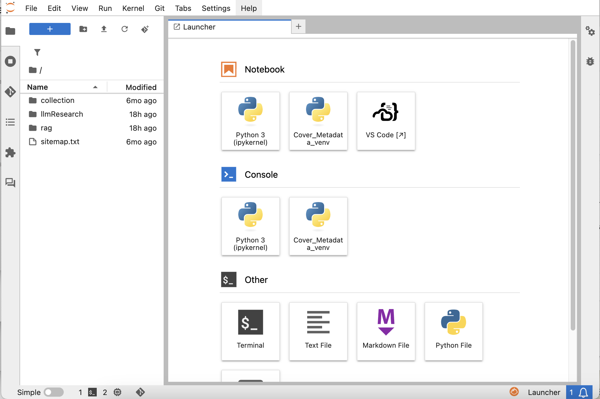
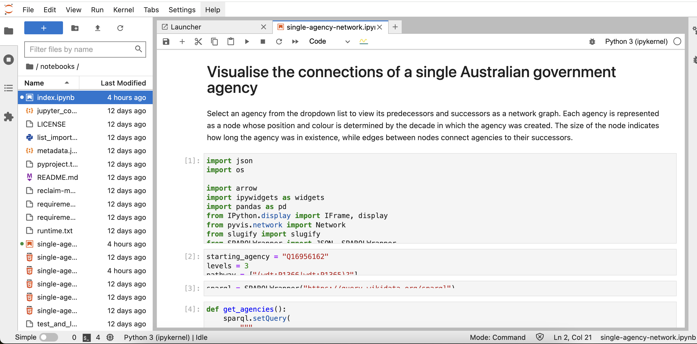

### Introduction to JupyterLab
- What is JupyterLab?
- How can you access it?
- Interface basics

### What is JupyterLab?
{ height=512px }

### JupyterLab:
- Browser-based interactive environment
- Combines functional code, data exploration, and presentation in a single portable file
- Supports Python, R, Julia, and more
- Ideal for data science, research, and teaching

### JupyterLab: Open Notebook
{ height=50% }

### Jupyter on Your Hardware
- Requires more setup effort
- Limited by your hardware, but keeps data local

### Jupyter Cloud-Based Options
- Multiple platforms available:
    - Google Colab
    - Kaggle Notebooks
    - Azure Notebooks
    - Binder
    - GitHub Codespaces
    - JupyterHub (e.g., Titan Computing Hub)

### Accessing JupyterLab via JupyterHub
- No local installation required
- Open a web browser (e.g., Chrome, Firefox)
- Navigate to your [JupyterHub URL](https://www.fullerton.edu/it/services/software/jupyter)

### Accessing JupyterLab via JupyterHub (cont.)
- Click `Launch JupyterHub`
- Select `JupyterHub (Nautilus)`
- Log in with campus credentials
    - Choose "Campus" from the provider dropdown

### Accessing JupyterLab via JupyterHub (cont.)
- Set minimum hardware requirements
- Click `Start` and wait for the instance to launch
    - Starts with 5GB of storage
    - Overfilling storage may prevent launching

### Closing JupyterLab
- Save your work: `File > Save Notebook`
- Log out via the Hub Control Panel (`File` menu)
- Session persists until timeout (set by admin)
- Reconnect by revisiting the JupyterHub URL

### JupyterLab Interface
- **Menu Bar**: File, Edit, View, Run options
- **Left Sidebar**: File browser, running kernels, extensions
- **Main Work Area**: Notebooks, terminals, text editors

### Demo: Leveraging Others' Work
- Example: [GLAM Workbench Wikidata](https://glam-workbench.net/wikidata/)
- (Your personal notes: `source venv/bin/activate`, `python -m jupyter lab`)

### Operations, Tips, and Shortcuts
- Create a Markdown cell
- Create a code cell
- Run cells
- Use Command Mode and keyboard shortcuts

### Closing JupyterLab (Repeated for Emphasis)
- Save your work: `File > Save Notebook`
- Log out via the Hub Control Panel (`File` menu)
- Session persists until timeout (set by admin)
- Reconnect by revisiting the JupyterHub URL

### Where to Go from Here
- Experiment with JupyterHub to assess its value
- Learn to install and use Jupyter locally
    - Explore [Carpentries workshops](https://carpentries.org/workshops/upcoming-workshops/)
- Self-study via [LinkedIn Learning](https://www.linkedin.com/learning/introducing-jupyter/present-data-like-a-pro-with-jupyter)
- Return to JupyterHub when it fits your research needs

### Resources
- [JupyterLab Documentation](https://jupyterlab.readthedocs.io/en/stable/)
- [JupyterHub User Guide](https://nationalresearchplatform.org/documentation/userdocs/jupyter/jupyterhub-service/)
- [CSUF JupyterHub](https://www.fullerton.edu/it/services/software/jupyter/)
- [Carpentries: Open Data Science Education](https://carpentries.org/)
- [LinkedIn Learning: Jupyter](https://www.linkedin.com/learning/introducing-jupyter/)
