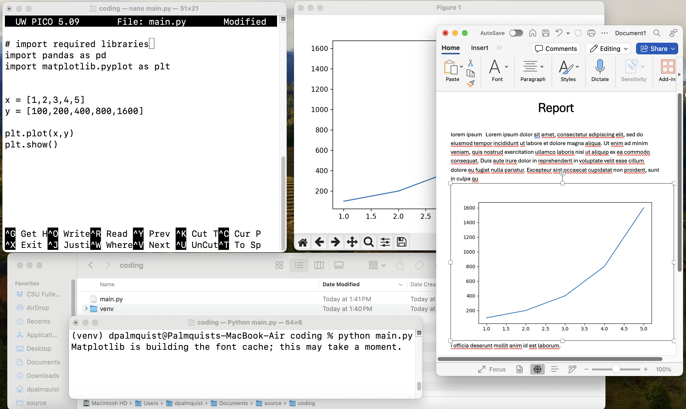
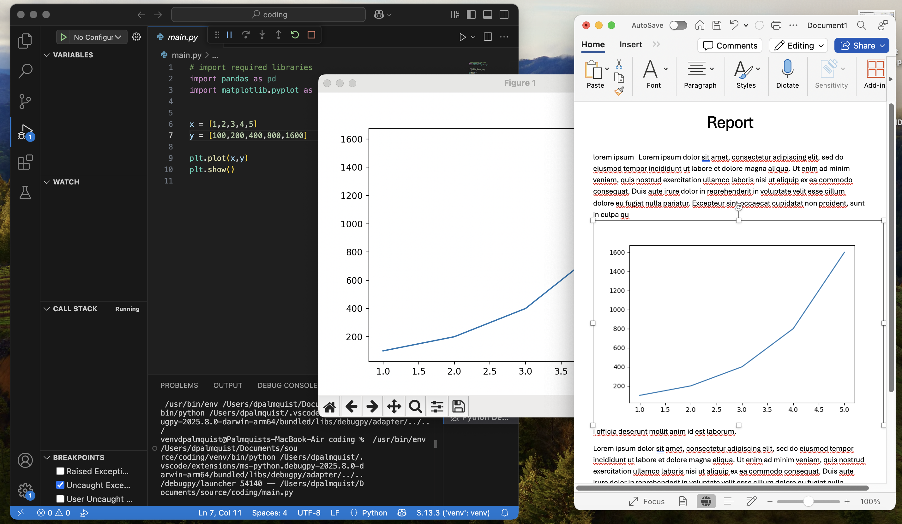
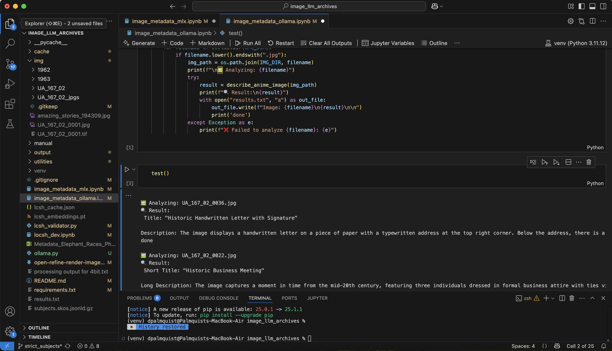

### Introduction to JupyterLab 
- David Palmquist
    - Library Systems Team, CSUF Pollak Library

### What will be touched on
- What is JupyterLab
- Where can you run it
- Interface basics
- Resources
- Q & A

### What is JupyterLab?
- Browser-based interactive environment
- Combines functional code, data exploration, and presentation in a single portable file
- Supports Python, R, Julia, and more
- Ideal for data science, research, and teaching

### JupyterLab: power of this, without all the clutter
{ height=50% }

### Or if you prefer, much of this, less clutter
{ height=50% }

### Vanilla out of the box, looks something like this 
{ height=50% }

### And you can even go inception and Juptyer like this
{ height=50% }

### Where can you run Jupyter

### Jupyter on Your Hardware
- Requires more setup effort
- Limited by your hardware, but keeps data local
- Example of launching local
    - Notice: URL location

### Jupyter Cloud-Based Options
- Multiple platforms available:
    - Google Colab
    - Kaggle Notebooks
    - Azure Notebooks
    - Binder
    - GitHub Codespaces
    - JupyterHub (e.g., Titan Computing Hub)

### Today we will focus on univeral tips for the common experience
- In the interest of time, lets all work from this jupyter lite example:
[https://jupyter.org/try-jupyter/lab/](https://jupyter.org/try-jupyter/lab/)
    - jupyter lite is limited since it runs in a browswer sandbox
        - requires no installation
        - does not retain anything

### JupyterLab Interface
- **Menu Bar**: File, Edit, View, Run options
- **Left Sidebar**: File browser, running kernels, extensions
- **Main Work Area**: Notebooks, terminals, text editors

### Operations, Tips, and Shortcuts 1
- Create a notebook
- Open a notebook
- Create a Code Cell
- Run cells

### Operations, Tips, and Shortcuts 2
- Markdown cell
    - Headings
    - Lists
        - ordered
        - unordered       
    - Links
    - Images ``

### Operations, Tips, and Shortcuts 3
- Use Command Mode and keyboard shortcuts
    - [esc]
    -[a],[b],[x],[z],[m],[y]
- magic commands
    - `%%time
    sum(i**2 for i in range(1, 50000001))`

### Kernels
- Interrupt
- Restart
    - while True: x=5

### Where to Go from Here
- Experiment with Jupyter to assess its value to your process
    - Explore what your colleagues have already done:
        - [Berkely Data Science Modules](https://ds-modules.github.io/library/)
        - [Gallery of Notebooks (api-issue)]
            - [CS-direct](https://github.com/yoavram/CS1001.py/blob/master/recitation1.ipynb)
            - [Soc-direct](https://github.com/nealcaren/workshop_2014/blob/master/notebooks/1_into.ipynb)
- Learn to install and use Jupyter locally
    - Explore [Carpentries workshops](https://carpentries.org/workshops/upcoming-workshops/)
- Self-study via [LinkedIn Learning](https://www.linkedin.com/learning/introducing-jupyter/present-data-like-a-pro-with-jupyter)

### Resources
- [Berkely Data Science Modules](https://ds-modules.github.io/library/)
- [Gallery of Notebooks](https://github.com/Carreau/ipython-wiki/blob/master/A-gallery-of-interesting-IPython-Notebooks.md)
- [JupyterLab Documentation](https://jupyterlab.readthedocs.io/en/stable/)
- [nbviewer](https://nbviewer.org/)
- [JupyterHub User Guide](https://nationalresearchplatform.org/documentation/userdocs/jupyter/jupyterhub-service/)
- [Carpentries: Open Data Science Education](https://carpentries.org/)
- [LinkedIn Learning: Jupyter](https://www.linkedin.com/learning/introducing-jupyter/)